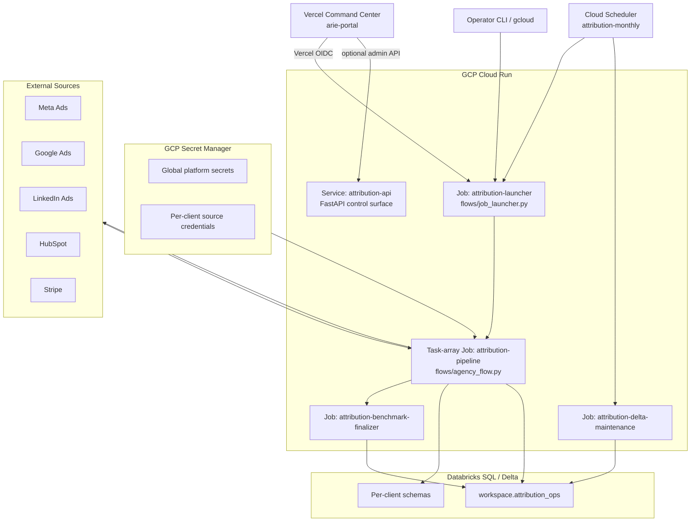
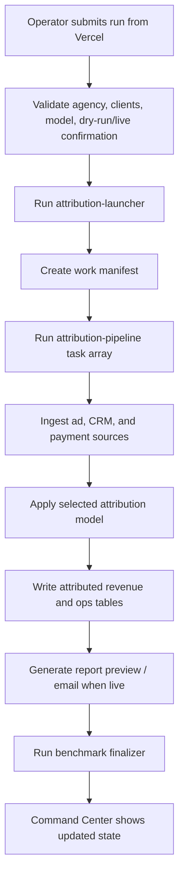

# ARIE Architecture

ARIE is a managed B2B attribution system. The current production architecture
uses Vercel for the operator UI, Cloud Run for execution, GCP Secret Manager for
credentials, and Databricks SQL/Delta for persistence.

## System Context

## Operator UI

`arie-portal/` is the only supported command center. It provides:

- Agency and tenant overview.
- Guarded dry-run/live attribution execution.
- Tenant lifecycle requests.
- Run history, warnings, alerts, report previews, and governance views.
- Server-side Databricks reads.
- Server-side Cloud Run job execution through Vercel OIDC and GCP Workload
  Identity Federation.

The browser never receives Databricks, GCP, or ARIE API credentials.

## Execution Flow

## Data Layer

Databricks remains the durable system of record:

- `workspace.attribution_ops` stores run history, checkpoints, reports,
  approvals, alerts, audit events, cost ledger entries, client registry records,
  and tenant lifecycle state.
- Per-client schemas store raw source data, normalized ad data, attribution
  outputs, and channel performance tables.

## Credential Boundary

- Vercel uses Basic Auth for the internal pilot UI.
- Vercel-to-GCP execution uses Workload Identity Federation, not service-account
  JSON keys.
- Global platform secrets and per-client source credentials live in GCP Secret
  Manager.
- Client registry records store secret IDs, not credential values.

## Retired UI Paths

The Streamlit command center, Replit command center, desktop launcher, and
static prototype have been retired. New UI work should go into `arie-portal/`.
