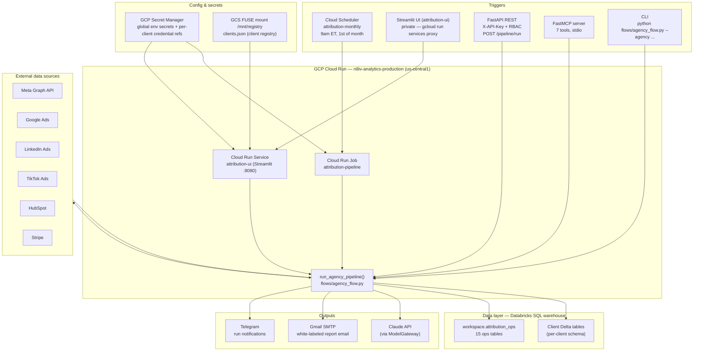
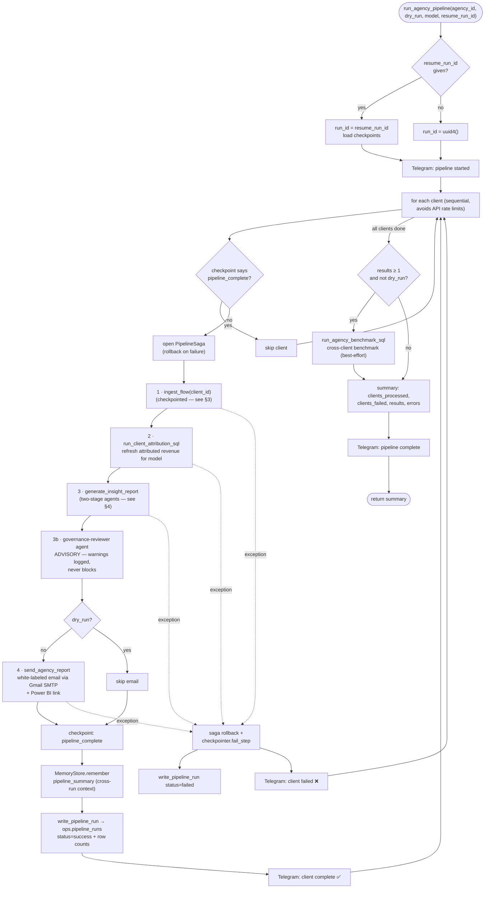
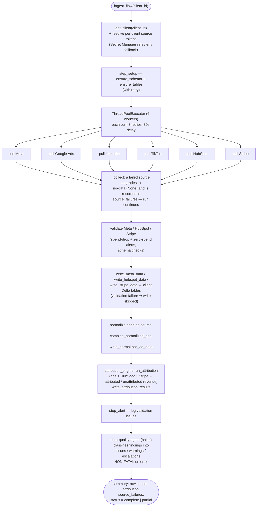
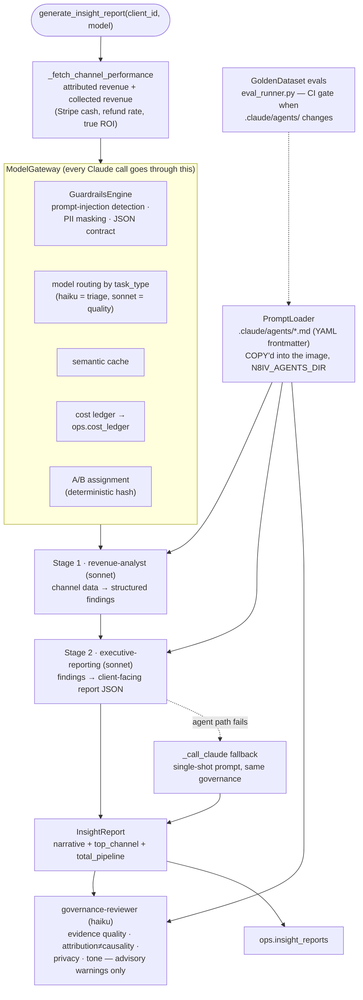
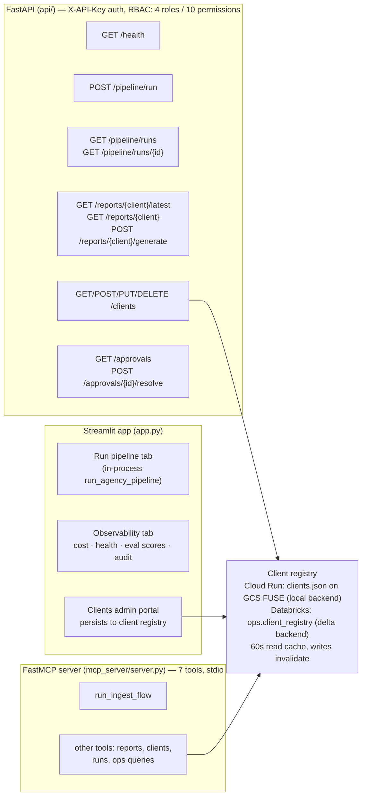
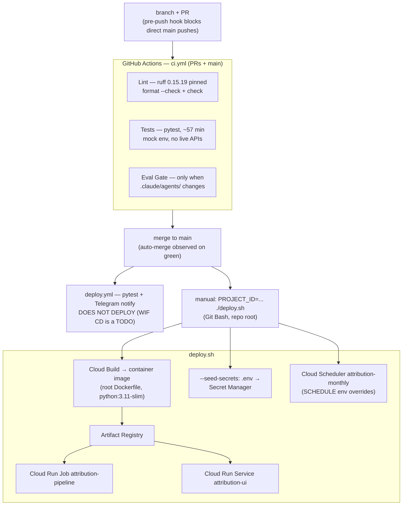

# ARIE Architecture & Data Flow

Flowcharts of ARIE, the Automatic Revenue Intelligence Engine, from triggers
down to the individual pipeline steps. Diagrams are Mermaid — GitHub renders
them inline.

Verified against the code on 2026-07-06 (`flows/agency_flow.py`,
`flows/ingest_flow.py`, `agents/`, `api/`, `mcp_server/`, `deploy.sh`).

## 1. System context — how a run starts and where data goes

Compute lives on Cloud Run because the Databricks Serverless Egress Gateway
blocks DNS to api.stripe.com / graph.facebook.com / api.hubapi.com. All Delta
reads/writes go through `utils/databricks_writer.py` using
`databricks-sql-connector` over public HTTPS.

## 2. Agency pipeline — `run_agency_pipeline()` per-client loop

Every numbered step is checkpointed to `ops.pipeline_checkpoints`; a resumed
run (`--resume-run-id`) skips steps already marked complete.

## 3. Ingest flow — `ingest_flow(client_id)`

Disabled channels are skipped. An enabled channel with a missing or expired
credential fails non-fatally, lands in `source_failures`, and the run reports
`status: "partial"`.

## 4. AI layer — two-stage insight generation and governance

The data-quality agent (§3) is the fourth versioned agent and rides inside
`ingest_flow`, not the report path.

## 5. Interfaces — REST, MCP, UI

## 6. Build, CI, and deploy

## 7. Ops tables (`workspace.attribution_ops`)

Created idempotently by `ensure_ops_tables()` at startup:

| Concern | Tables |
|---|---|
| Run tracking | `pipeline_runs`, `pipeline_checkpoints`, `idempotency_store` |
| Reporting | `insight_reports`, `approval_queue` |
| Governance & audit | `audit_log` |
| Cost & caching | `cost_ledger`, `semantic_cache` |
| Agent context | `agent_memory` |
| Evals | `eval_golden_dataset`, `eval_results` |
| Experiments | `ab_experiments`, `ab_assignments` |
| Clients | `client_registry` |
